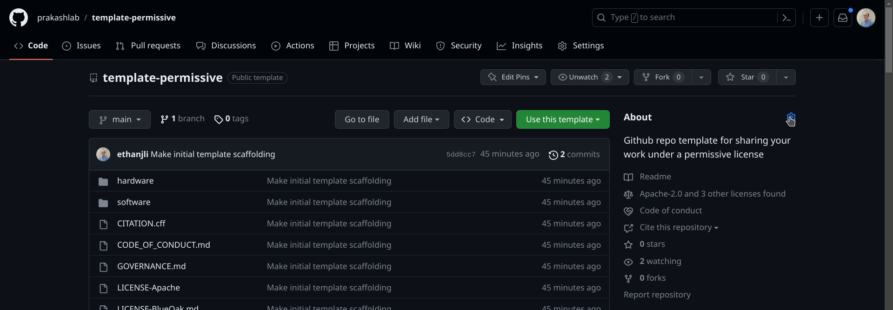

# template-permissive
Github repository template for sharing your work under a permissive license

## Introduction

This repository is a base Github repository template for projects in the Prakash Lab, providing a set of defaults to help projects get their work on Github. This repository template is a permissive variant providing a default set of licenses for sharing your work under permissive open-source/open hardware licenses.

Github repositories created using this template must be customized afterwards. Please refer to https://www.notion.so/Github-hosting-of-code-design-files-6c0f5557d3c643098c7cfe3c9de60467 on our lab's private Notion for details and context.

## Usage

### Making a new repository

Refer to https://docs.github.com/en/repositories/creating-and-managing-repositories/creating-a-repository-from-a-template for step-by-step instructions about how to make a repository from a repository template (this repository at https://github.com/prakashlab/template-permissive is a repository template). You should probably make the new repository under the prakashlab organization.

### Customizing the repository details

You should modify the details of this repository by clicking the gear icon in the upper-right corner of the sidebar of the repository's main page, which has an "About" heading along with a short description of the repository, a listing of some additional information, and a link to report the repository.

If/when you have a project website, you should add the website URL to the repository details.

### Customizing the `README.md` file

The file you're reading is the repository's `README.md` file. It is shown by default whenever anyone opens the base URL for your repository (which will be of the format https://github.com/prakashlab/template-permissive).

The first line of the repository's `README.md` file (which is `# template-permissive`) needs to be updated to match the name of your repository. The second line of this file (which is `Github repository template for sharing your work under a permissive license`) needs to be updated to be a short one-line description of your project.

The *Introduction* section in the repository's `README.md` file should be updated to provide a slightly longer (but still brief) description of this project. If your project involves hardware, you may want to include photos and/or videos of the hardware you're sharing. https://github.blog/2021-05-13-video-uploads-available-github/ provides more information about how to embed videos in Markdown files such as this `README.md` file; note that Github does not let you embed iframes into your `README.md` file.

The *Usage* section in the repository's `README.md` file should be updated to contain instructions for how someone who is not familiar with your project can use your project.

The *Contributing* section of the repository's `README.md` file provides information for anyone interested in contributing any kind of work to this project. You should review it and determine if any changes need to be made for your specific project.

The *Citing* section of the repository's `README.md` file provides information for anyone interested in citing your work in an academic paper. You will need to replace all content in the section. If you would like to create a DOI for a snapshot release of your repository on Zenodo (see https://docs.github.com/en/repositories/archiving-a-github-repository/referencing-and-citing-content#issuing-a-persistent-identifier-for-your-repository-with-zenodo for step-by-step instructions on how to do so), you should add the DOI to this section.

The *Licensing* section of the repository's `README.md` file provides information for anyone interested in copying, modifying, or otherwise making use of the work provided by this project. You will need to replace the email address `lietk12@gmail.com` listed near the top of the Licensing section. You will also need to modify the name of the project `template-permissive` listed in each copyright statement. If your project does not include any software, you should remove the *Software* subsection; if your project does not include any hardware, you should remove the *Hardware* subsection. You should also review everything in this section and determine if any other changes need to be made for your specific project.

### Customizing the `LICENSE` files

If you are changing the licenses described in the Licensing section of the repository's `README.md` file, you will also need to modify the `LICENSE` files provided by this repository - currently, they are named `LICENSE-SHL`, `LICENSE-Apache`, `LICENSE-BlueOak`, and `LICENSE-CC-BY`. Note that the `LICENSE-SHL` file for the Solderpad Hardware License refers to the contents of the `LICENSE-Apache` file, so you should keep the `LICENSE-Apache` file even if your project is hardware-only, as long as you are using the Solderpad Hardware License.

### Customizing the `CODE_OF_CONDUCT.md` file

The `CODE_OF_CONDUCT.md` file defines standards for how everyone will engage with each other on this project, in order to make it more safe, welcoming, and inclusive. More details are available at https://docs.github.com/en/communities/setting-up-your-project-for-healthy-contributions/adding-a-code-of-conduct-to-your-project . This template repository includes a default provided by the [Contributor Covenant](https://www.contributor-covenant.org/); you will need to customize it by replacing the email address `lietk12@gmail.com` with your own email address. You should also read it to make sure you understand what the code of conduct requires from you.

### Customizing the `GOVERNANCE.md` and `MAINTAINERS.toml` files

The `GOVERNANCE.md` file describes how the project is maintained and how decisions are made. Nothing needs to be customized per se, but you should review the document and determine if any changes need to be made for your specific project.

The `MAINTAINERS.toml` file contains a list of people who currently serve (and/or have previously served) as maintainers for this project. You should update the list of people, replacing `ethanjli`, `Ethan Li`, and `lietk12@gmail.com` with the appropriate values, and adding more people as needed.

### Customizing the `CITATION.cff` file

To help users correctly cite your work, you should customize the repository's `CITATION.cff` file based on the instructions at https://docs.github.com/en/repositories/managing-your-repositorys-settings-and-features/customizing-your-repository/about-citation-files . If you don't have anything to cite, you should delete this file for now, and then you can add a new `CITATION.cff` file once you have something citable.

### Customizing the `hardware` directory

If your project provides hardware, you should refer to the `hardware/README.md` file for further instructions on customizing this repository. Otherwise, you can delete the `hardware` folder from this repository.

### Customizing the `software` directory

If your project provides software, you should refer to the `software/README.md` file for further instructions on customizing this repository. Otherwise, you can delete the `software` folder from this repository.

## Contributing

Currently, this project only accepts outside contributions in the form of bug reports, feature requests, documentation improvements, and bug fixes. Additional features carry a long-term maintenance burden which this project is not yet mature enough to support, so pull requests adding new features will not be accepted at this time. Please start a new discussion (in the "Discussions" tab of this repository on Github) if you have a new feature you'd like to propose for this project.

## Citing

To cite this work in a paper, please cite the following paper:

**Handyfuge-LAMP: low-cost and electricity-free centrifugation for isothermal SARS-CoV-2 detection in saliva**

- Ethan Li\*, Adam Larson\*, Anesta Kothari, Manu Prakash†
- Correspondence: manup@stanford.edu
- [medRxiv preprint](https://www.medrxiv.org/content/10.1101/2020.06.30.20143255v1), July 2020

\* indicates equal contributions, while † denotes corresponding author.

You can copy a citation for this paper formatted in APA or BibTex format from the "Cite this repository" widget in the sidebar of this repository on Github.

## Licensing

We have chosen the following licenses in order to give away our work for free, so that you can freely use for whatever purposes you have, with minimal restrictions while still protecting our disclaimer that this work is provided without any warranties at all. If you're using this project, or if you have questions about the licenses, we'd love to hear from you - please start a new discussion thread in the "Discussions" tab of this repository on Github or email us at lietk12@gmail.com .

### Software

Except where otherwise indicated in this repository, software files provided here are covered by the following information:

**Copyright Prakash Lab and template-permissive project contributors**

SPDX-License-Identifier: `Apache-2.0 OR BlueOak-1.0.0`

Software files in this project are released under the [Apache License v2.0](https://www.apache.org/licenses/LICENSE-2.0) and the [Blue Oak Model License 1.0.0](https://blueoakcouncil.org/license/1.0.0); you can use the source code provided here under the Apache License or under the Blue Oak Model License, and you get to decide which license you will agree to. We are making the software available under the Apache license because it's [OSI-approved](https://writing.kemitchell.com/2019/05/05/Rely-on-OSI.html) and it goes well together with the [Solderpad Hardware License](https://solderpad.org/licenses/SHL-2.1/), which is an open hardware license used in various projects released by the Prakash Lab; but we like the Blue Oak Model License more because it's easier to read and understand. Please read and understand the licenses for the specific language governing permissions and limitations.

### Hardware

Except where otherwise indicated in this repository, hardware files provided here are covered by the following information:

**Copyright Prakash Lab and template-permissive project contributors**

SPDX-License-Identifier: `Apache-2.0 WITH SHL-2.1`

Hardware files in this project are released under the [Solderpad Hardware License v2.1](https://solderpad.org/licenses/SHL-2.1/). Note that the Solderpad Hardware License operates as a wraparound license to the Apache License and must be read in conjunction with the Apache License. Please read and understand the licenses for the specific language governing permissions and limitations.

### Everything else

Except where otherwise indicated in this repository, any other files (such as images, media, data, and textual documentation) provided here not already covered by software or hardware licenses (described above) are instead covered by the following information:

**Copyright Prakash Lab and template-permissive project contributors**

SPDX-License-Identifier: `CC-BY-4.0`

Files in this project are released under the [Creative Commons Attribution 4.0 International License](http://creativecommons.org/licenses/by/4.0/). Please read and understand the license for the specific language governing permissions and limitations.
